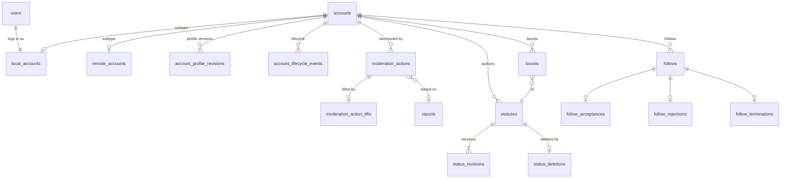
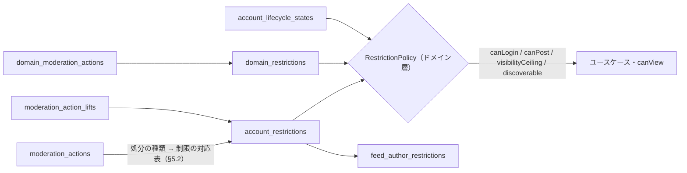

## 3. 概念モデル

### 3.1 モジュールと主な概念

```mermaid
erDiagram
    users ||--|| local_accounts : "logs in as"
    accounts ||--o| local_accounts : "subtype"
    accounts ||--o| remote_accounts : "subtype"
    accounts ||--o{ account_profile_revisions : "profile versions"
    accounts ||--o{ account_lifecycle_events : "lifecycle"
    accounts ||--o{ moderation_actions : "sanctioned by"
    moderation_actions ||--o| moderation_action_lifts : "lifted by"
    moderation_actions }o--o| reports : "based on"
    accounts ||--o{ statuses : "authors"
    statuses ||--|{ status_revisions : "versions"
    statuses ||--o| status_deletions : "deleted by"
    accounts ||--o{ boosts : "boosts"
    boosts }o--|| statuses : "of"
    accounts ||--o{ follows : "follows"
    follows ||--o| follow_acceptances : ""
    follows ||--o| follow_rejections : ""
    follows ||--o| follow_terminations : ""
```

### 3.2 イベントから投影への流れ（例: 処分）

```mermaid
flowchart LR
    A[moderation_actions] -->|"処分の種類 → 制限の対応表（§5.2）"| R[account_restrictions]
    L[moderation_action_lifts] --> R
    D[domain_moderation_actions] --> DR[domain_restrictions]
    R --> P{"RestrictionPolicy（ドメイン層）"}
    DR --> P
    LC[account_lifecycle_states] --> P
    P -->|canLogin / canPost / visibilityCeiling / discoverable| UseCases[ユースケース・canView]
    R --> F[feed_author_restrictions]
```
